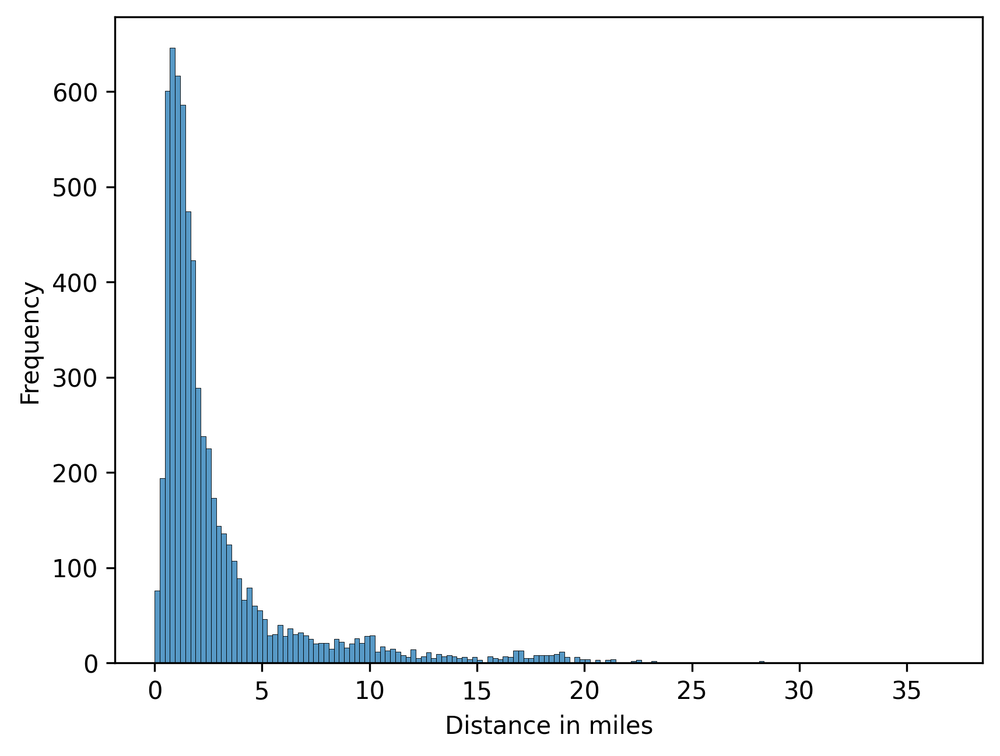
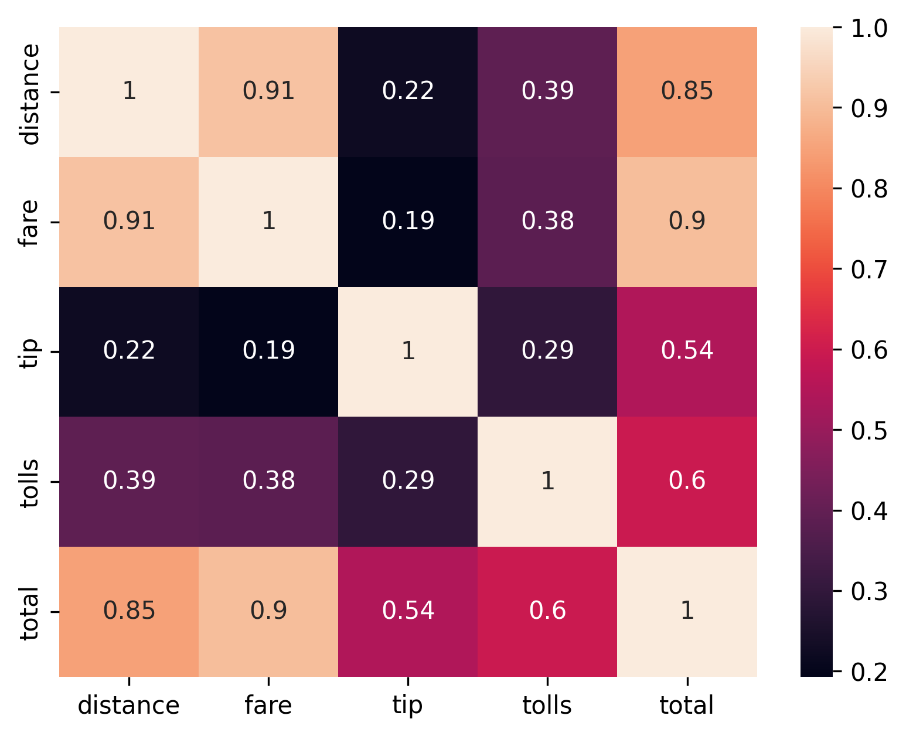
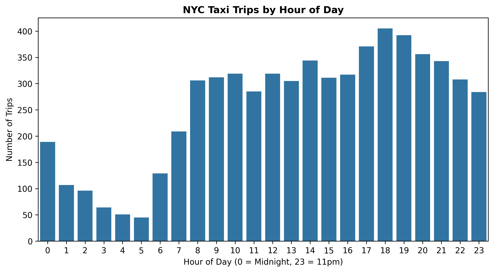
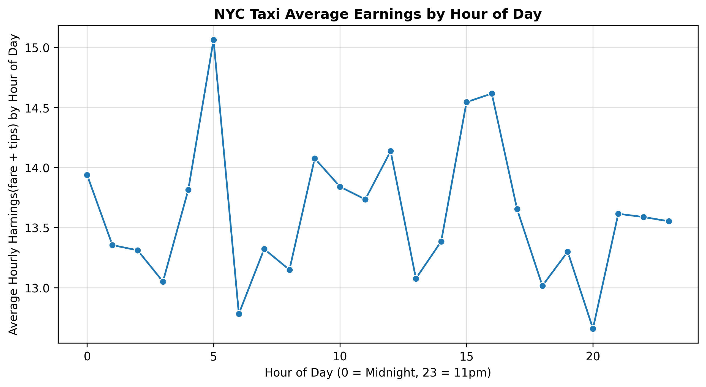
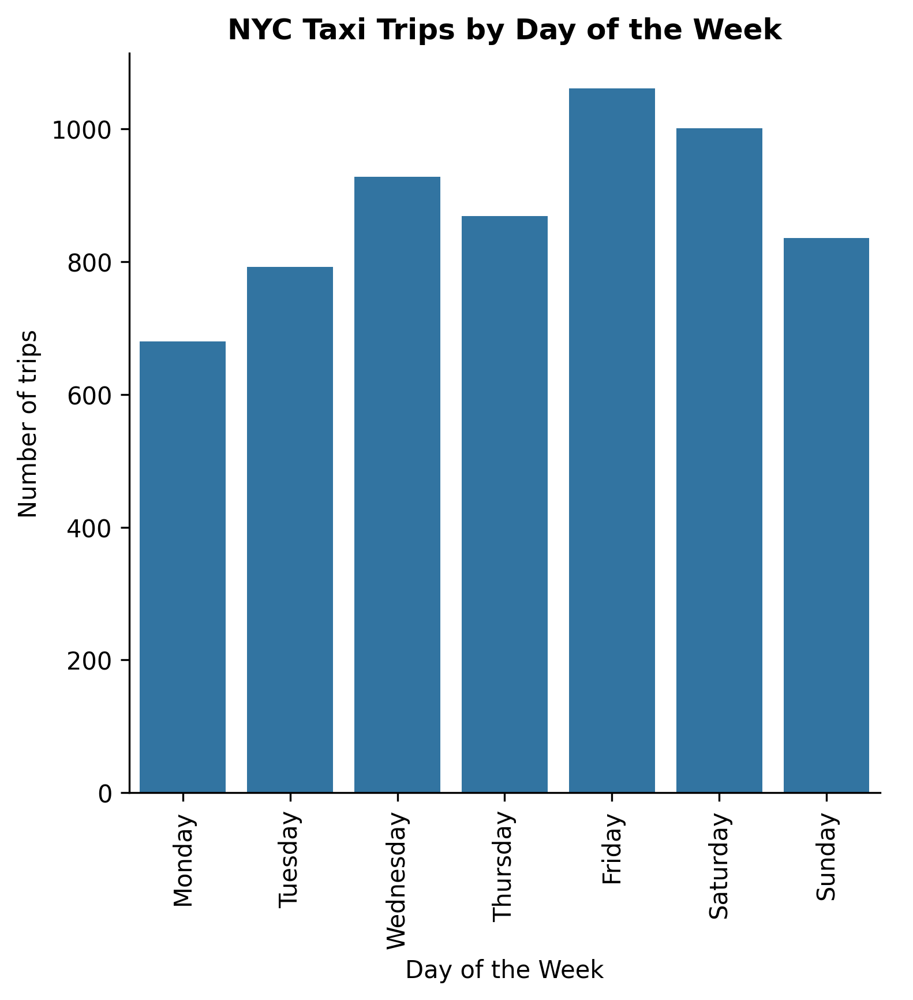
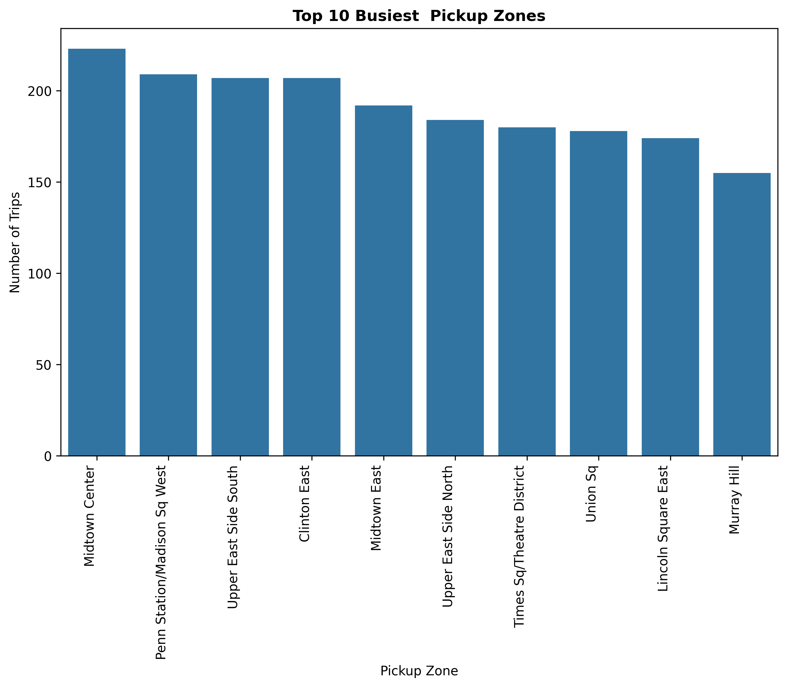
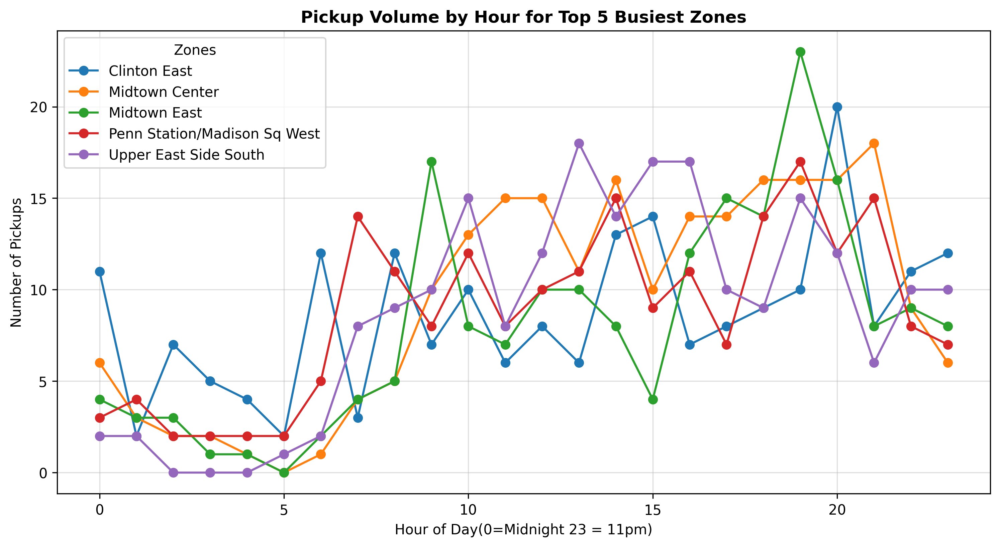
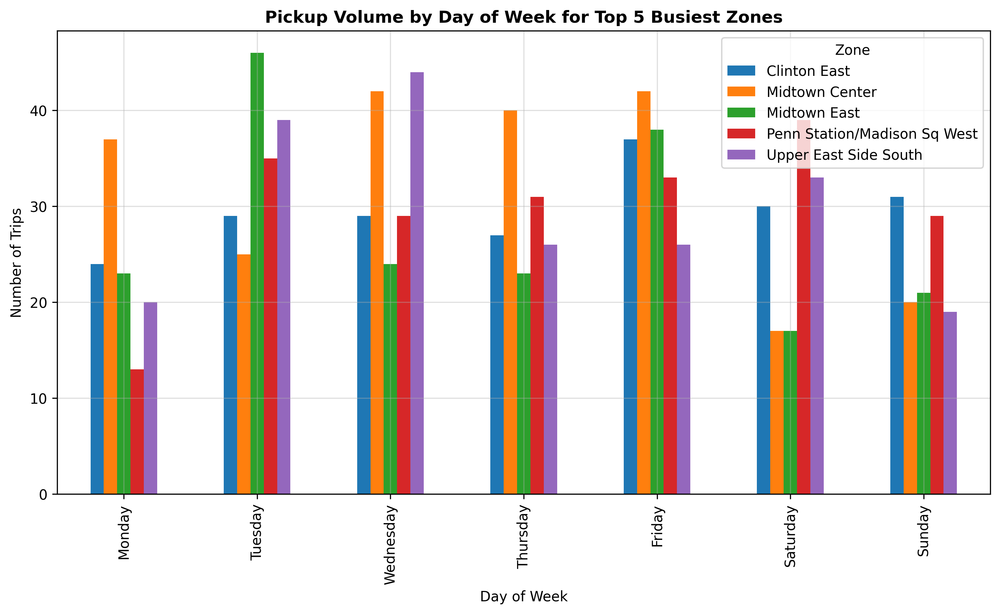

### *Driver Scheduling Optimization with NYC Taxi Data*

*Optimizing Taxi Driver Scheduling to Reduce Idle Time and Increase Earnings*

*1. The Problem*  
Taxi drivers lose money driving around empty because they don’t know when and where demand is high. Companies also struggle to position drivers efficiently. I used New York City taxi trip data to find peak demand times and locations so drivers can be scheduled efficiently.

*2. The Data*  
I used Seaborn’s `taxis` dataset, which contains 6,433 trips across New York City.  
Some key features include the `pickup`, `dropoff`, `pickup_zone`, `dropoff_zone`, `distance`, `fare`, `tips`.
1. pickup: This refers to the time the passenger(s) were picked up from their zones.It contains both the date and time of the occurrence.
2. dropoff: This refers to the time the passenger(s) were droped off at their destinations. It also contains both the date and time of the occurrence.
3. pickup_zone: This refers to specific street or area in a particular borough or county where passengers were picked up.
4. dropoff_zone:This refers to the specific street or area in a particular borough or county where passengers were droped off, in orders words, their destination.
5. distance: This refers to the distance covered in miles from the pickup_zone to the dropoff_zone.
6. fare: This refers to the amount of money in dollars that the ride cost.
7. tips: This is an extra money in dollars paid by passengers freely, as a sign of generosity.

*3. What I Did*  
1. I started by previewing my dataset to have a quick overview of it, I realized some variables had inappropriate datatypes and  I changed them to the correct datatypes based on my knowledge about the dataset. I changed datatype of the following columns to "passengers", "color", "payment", "pickup_borough" and  "dropoff_borough" to categorical datatype, in order to avoid having wrong descriptive statistics and also to reduce memmory consumption. I also parsed columns containing date strings into datetime objects, so that the pickup and dropoff columns could be treated as date and time.

2. Still on the data cleaning, I checked for duplicate trips based on whether or not, the trips had the same pickup and dropoff dates, number of passengers and fare. After checking, I found no duplicates.

3. I proceeded to check columns with missing values and there were columns with missing values. I then set a threshold for dropping missing values, that is, if the number of missing values is below or equal to 5% of the size of the dataset, the rows with those null values would be dropped. It turned out that all the sum of null values in those columns were actually below the threshold so I dropped them. Before dropping them, I viewed those columns and discovered they couldn't be imputed either by mean, median, mode or by subgroups. To prevent any attempt to make-up real-world data, I dropped them.

4. I proceeded further to spot outliers in the distance column of the dataset, and there were a lot of them. I analysed them to see if there were anomalies and realized there were no anomalies, the outliers actually made sense. I analysed by checking the distance and the fares, if they had a strong positive correlation, (the farther the distance, the higher the fare) and it turned out to be true. I continued to check the pickup and dropoff borough and most of them were from Queens to Manhattan and vice versa. After a short research, I discovered the driving distance between Queens and Manhattan ranges from 12.5 - 15 miles, and the distance depends on where exactly(the pickup and dropoff zones) in these boroughs passengers were picked off and dropped off. I treated the outlier by subsetting trips with a distance either equal or below 15 miles. The reason being that, for drivers scheduling, I want to optimize for what drivers do 95% of the time, not just the rare top 5% (95% percentile sits around 15 miles). Keeping the top 5% which are rare, makes my averages misleading. I am solving problem by reducing idle times and increasing earnings for typical shifts, hence my decision in treating the outliers.

  
_Distribution of distance(miles)_

  
_The farther the distance the higher the fare_

6. I continued to validate the dataset, by undertaking cross-field validation. I checked whether "fare", "tips", and "toll" columns actually summed up to the "total" column. There were a few trip instances where they actually summed up, and it was mainly because they had $0 toll, but majority of the trips showed that these columns were inconsistent so, I created a new column "surcharges" to make these numerical columns consistent.

7. I extracted hour and day columns from the pickup column to be used for data aggregation and plots.

8. I found trip_duration columns by substracting pickup time for dropoff time and converted it to minutes.

9. I finalized creating new features, by creating total_earnings columns that summed up "fare" and "tips".

10. I grouped trips by hour and day to find demand patterns.

11. I calculated average earnings per hour to show when drivers make the most.

12. I identified top busy zones, pickup volumes per hour and per day of the week for these busy zones, to inform decisions.

13. I carried out all these tasks with Python's pandas, seaborn, matplotlib and datetime packages.
   

*4. Key Insights for Scheduling*  

- *Evening Peak hours are from 5pm-8pm*: Trips volume spike to ~ 400 trips/hr at 6pm. This can be due to people leaving their work places and nightlife, people going out at night.
- *Low times*:Demand drops from 1am-5am, hitting low at 5am with ~ 50 trips/hr.
- *Morning demand hours*: Trips volume increase from ~130 trips/hr at 6am to ~300 trips/hr at 9am, suggesting the time when people leave for work.
- *Actions*: Position drivers  in busy zones at 5am to capture the 6am to 9am trips demand and also at 4pm to capture the 5pm to 8pm bulk of demand.

  
_Trips peak during evening rush hour_

- *Peak earnings at 5am*: Hourly earnings hit ~ $15/hr at 5am. This could be airport runs and late night fares with less traffic.
- *Evening peak earnings*: Hourly earnings hit ~ $14.5/hr from 3pm to 4pm. Probably afternoon rides before evening congestion.
- *Lowest Earnings*: Hourly earnings hit low at ~ $12.8/hr - $13/hr from 6am to 8pm.
- *Actions*:For best hourly earnings, drivers should target 5am and 3pm - 5pm. Avoid 6am to 8pm unless demand is assured.

  
_Average fare + tip is highest 5pm-9pm_

- *Peak days are Fridays and Saturday*: There are more than 1000 trips on Friday, and ~ 980 trips on Saturday. Likely because of weekend outings and travels.
- *Midweek trends*:Wednesday and Thursday records ~900 trips and ~850 trips respectively, indicating there are business activities and weekday travel keeps demand high.
- Monday records the lowest trip volume (~ 680 trips).
- Sunday records trip volume of ~ 820 indicating that people actually return from their weekend travel on Sunday, before the work week.
- *Actions*: Maximize driver availability on Friday - Saturday evenings, also on Wednesday to Thursday for a constant revenue. Reduce driver availability on Monday and target the bulk of demand on Sunday to capture people returning from weekend travel.

  
_Peak days are Fri-Sat_

- *Demand is in few zones*: The top zone has about 220 trips, with the top 4 zones all above 200 trips, showing clear zones where most pickups occur.
- Center, West, South, East and North zones are included in the top ten hotspots indicating high activities in various directions of the city.
- Maximize driver availability in the top 4-5 zones to reduce empty rides and idle time and also capture the bulk of demand.

  
_Midtown Center has the highest trip volume_

- All five zones have low pickups from 12am to 5am.
- Volume jumps sharply across all zones after 6am, indicating people are moving out to work or to undertake their daily activities.
- 5pm to 8pm shows the highest demand, with Midtown East hitting ~23 pickups around 6pm.
- Penn Station/ Madison Sq West and Midtown Center are more stable throughout the day, and Clinton East and Midtown East shows the highest evening demand peaks.
- *Action*: Maximize driver availabilty at Clinton East and Midtown East by 4pm to capture the 5pm-8pm bulk of demand.

  
_Pickup Volume in Midtown East spike around 6pm_

- *Weekday Demand is highest*: Tuesday to Friday records most pickups across all five zones
- Monday records lower volume across the zones.
- Business zones like Midtown Center and Midtown East sees a sharp decline on Weekends, likely because business activities are reduced.
- Residential zones like Penn Station/ Madison Sq West maintain higher trip volumes on Weekends compared to the business zones like Midtown Center.
- *Actions*: Make drivers available Tuesday to Friday in Business Zones to capture the pickup demands, and shift to residental areas to capture weekend demands.

  
_Monday records lower volume across all the top 5 zones_

*5. How to View It*
pip install -r requirements.txt
cd notebook
jupyter notebook taxi_driver_scheduling.ipynb

*6. Business Impact*  
If drivers follow these actionable insights, they can reduce idle time and empty drives and increase hourly earnings by 20-30%. For a taxi company, this means better driver retention, lower passenger wait times and higher revenue.
*7. Next Steps*
I would continue to analyze the outliers (trips with distance more than 15 miles) to reveal any hidden insights and  conduct hypothesis testing to verify whether the insights are accurate. 
